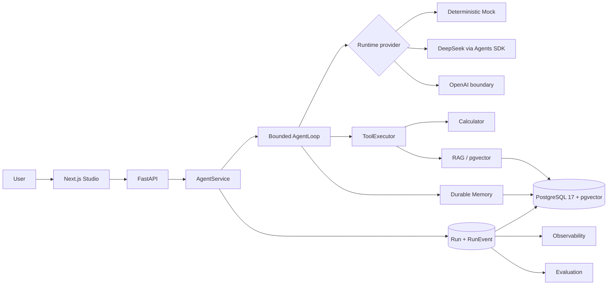

# Agent Studio

[](https://github.com/kallist/agent-studio/actions/workflows/ci.yml)
[](https://github.com/kallist/agent-studio/actions/workflows/delivery.yml)

Agent Studio is a development and debugging platform for building, running, tracing, and evaluating tool-using AI agents with retrieval and durable memory. It is an agent-lifecycle workbench—not a chatbot shell or a single RAG demo.

The default experience is deterministic and needs no API key. The same application-owned runtime boundary also supports an opt-in, real-tested DeepSeek path and an implemented OpenAI Responses boundary whose live execution remains **NOT TESTED**.


## Why it exists

Agent behavior is difficult to debug when execution policy, tools, retrieval, memory, traces, and evaluation live in unrelated systems. Agent Studio keeps those concerns behind explicit application boundaries and persists the evidence needed to explain a result:



Execution remains application-owned:

```text
User message → bounded context → provider decision → validated tool call
→ persisted events → next step or terminal answer → memory finalization
```

## v1 capabilities

| Area | Capability | Status |
|---|---|---|
| Runtime | Bounded steps, retries, timeout, cancellation, typed termination | **IMPLEMENTED · TESTED** |
| Tools | Server-owned registry and safe Calculator execution | **IMPLEMENTED · TESTED** |
| RAG | Async ingestion, semantic/lexical/hybrid retrieval, completed-only visibility, citations | **IMPLEMENTED · TESTED** |
| Memory | Agent-scoped policy, ranking, dedupe, expiration, deletion, transaction ordering | **IMPLEMENTED · TESTED** |
| Observability | Persisted `Run`/ordered `RunEvent`, trace UI, usage and latency projection | **IMPLEMENTED · TESTED** |
| Evaluation | Real isolated Runs, deterministic graders, PASS/FAIL/ERROR, reproducible snapshots | **IMPLEMENTED · TESTED** |
| Persistence | SQLite local fallback; PostgreSQL 17, `vector(256)`, HNSW | **IMPLEMENTED · TESTED** |
| Providers | Mock default; DeepSeek Chat Completions | **IMPLEMENTED · REAL TESTED** |
| Providers | OpenAI Responses and OpenAI embeddings boundaries | **IMPLEMENTED · LIVE NOT TESTED** |
| Delivery | Production-like Docker runtime and automated CI/Delivery gates | **IMPLEMENTED · TESTED** |

The evidence and limitations behind each claim are in the [v1 source-of-truth matrix](docs/V1_STATUS.md).

## Recommended quick start

Prerequisite: Docker Desktop, or Docker Engine with Docker Compose.

```powershell
docker compose up --build -d
```

Open [http://127.0.0.1:3000](http://127.0.0.1:3000). The default stack runs the production Next.js server, one Uvicorn API process, and PostgreSQL 17 with pgvector. It binds Web and API only to loopback, keeps PostgreSQL on an internal Docker network, and generates the database credential in a project-scoped named volume.

On Windows, the checked helper validates the daemon, ports, provider configuration, Compose model, and health:

```powershell
.\scripts\docker-up.ps1
.\scripts\docker-down.ps1
```

Normal shutdown preserves PostgreSQL, uploaded knowledge sources, and runtime-secret volumes. `docker-down.ps1 -PurgeData` is deliberately destructive and requires an exact project-name confirmation.

## Five-minute demo

The full click-by-click script is [docs/DEMO.md](docs/DEMO.md). The short path is:

1. Open **Agent Builder** and create **Agent Studio Demo KB** in **Knowledge / RAG**.
2. Upload [the original demo knowledge document](docs/demo/agent-studio-demo-knowledge.md) and wait for `completed`.
3. Bind the knowledge base, keep **Mock** selected, enable Calculator and Durable Memory, and save **Demo Lifecycle Agent**.
4. In **Playground**, run `Calculate 128 * 37 + 456`; verify `5192`, Tool Call, Tool Result, and the ordered trace.
5. Run `Remember that my preferred demo environment is PostgreSQL.` and then ask `What demo environment do I prefer, and what recovery codename does the handbook use?`; inspect Memory and citation events.
6. In **Evaluations**, create **v1 Demo Evaluation** with expected text `5192` and tool `calculator`; run it and open the linked Run Trace.
7. Finish on **Dashboard** to show persisted runs and measured telemetry.

Mock usage is shown as N/A because no model request occurs. RAG and Memory content are treated as untrusted data, not system instructions.

## Optional providers

Mock is the default and requires no key. DeepSeek is opt-in and has real online validation. For the Docker runtime, provide the key only to the host process and use:

```powershell
.\scripts\docker-up.ps1 -Provider deepseek
```

The helper streams the value over stdin into a project-scoped, API-only secret volume; it is not a build argument, source file, command-line value, or persistent container environment value. OpenAI has an equivalent `-Provider openai` path, but real OpenAI Responses, embeddings, and OpenAI-plus-pgvector remain **NOT TESTED**. There is never silent provider fallback.

See [Model providers](docs/MODEL_PROVIDERS.md), [Configuration](docs/CONFIGURATION.md), and [Container runtime](docs/CONTAINER_RUNTIME.md).

## Local development

Prerequisites: Python 3.12+, Node.js 24+, and pnpm 10+.

```powershell
python -m venv .venv
.\.venv\Scripts\python.exe -m pip install -e ".\apps\api[dev]"
pnpm --dir apps/web install --frozen-lockfile
```

Start the API and Web app in separate terminals:

```powershell
.\.venv\Scripts\uvicorn.exe app.main:app --app-dir apps/api --host 127.0.0.1 --port 8000
pnpm --dir apps/web dev --hostname 127.0.0.1
```

Host development defaults to the ignored SQLite database. An explicit PostgreSQL URL is never silently replaced with SQLite if connection or pgvector initialization fails. The guarded real-database setup is documented in [PostgreSQL + pgvector](docs/POSTGRESQL_PGVECTOR.md).

## Quality and validation

```powershell
.\.venv\Scripts\ruff.exe check apps/api scripts/ci
.\.venv\Scripts\mypy.exe apps/api/app
.\.venv\Scripts\pytest.exe apps/api/tests -m "not postgresql and not real_openai and not real_deepseek and not performance" -q
pnpm --dir apps/web test:run
pnpm --dir apps/web typecheck
pnpm --dir apps/web lint
pnpm --dir apps/web build --webpack
pnpm --dir apps/web e2e
```

CI runs independent Backend, PostgreSQL, Frontend, Playwright, Docker, Reliability, and Performance jobs. Delivery Validation builds fresh production images and exercises startup, Calculator, RAG/pgvector, Memory, Evaluation, persistence/recovery, and container-targeted E2E. It publishes validation evidence only—no registry image and no public deployment.

## Engineering highlights

- `AgentLoop` owns limits, retries, timeout, cancellation, event ordering, and terminal state instead of delegating product policy to an SDK.
- `ToolExecutor` owns schema validation, permissions, timeouts, output limits, execution, and audit events; model callbacks are capture-only.
- RAG retrieval and citations expose only completed ingestion generations, preventing partial or failed replacement data from leaking into runs.
- Durable Memory has explicit write/retrieval/expiration/delete policy plus deterministic SQLite and PostgreSQL transaction ordering.
- Persisted `Run` and ordered `RunEvent` records are the lineage truth; dashboards and evaluation are projections, not alternate traces.
- Deterministic Evaluation uses evaluation-owned Agent snapshots and real Runs while keeping evaluation traffic out of normal dashboard metrics.
- The production-like stack runs non-root, read-only app containers, internal-only PostgreSQL, bounded logs, runtime secrets, and fail-closed readiness.

## Known limitations

Agent Studio v1 is a single-user local development workbench and must not be exposed as a public/shared service.

- Authentication, authorization, RBAC, multi-tenancy, and global rate limiting: **NOT IMPLEMENTED**.
- Horizontal/multiprocess API operation and managed PostgreSQL: **NOT TESTED**.
- Distributed workers, Kubernetes, public TLS/ingress, backup automation, cloud secret management, and automatic public deployment: **NOT IMPLEMENTED**.
- Real OpenAI Responses, OpenAI embeddings, OpenAI with pgvector, and internet production load: **NOT TESTED**.
- Full chaos engineering, high availability, zero-downtime delivery, and production SLA: **NOT IMPLEMENTED / NOT CLAIMED**.

See [V1 status and limitations](docs/V1_STATUS.md) and [Security](docs/SECURITY_DESIGN.md).

## Documentation

- [Architecture](docs/ARCHITECTURE.md) and [runtime ADR](docs/ADR/001-agent-runtime.md)
- [RAG](docs/RAG_DESIGN.md), [Memory](docs/MEMORY_DESIGN.md), [Observability](docs/OBSERVABILITY_DESIGN.md), and [Evaluation](docs/EVALUATION_DESIGN.md)
- [Security](docs/SECURITY_DESIGN.md) and [Model providers](docs/MODEL_PROVIDERS.md)
- [PostgreSQL + pgvector](docs/POSTGRESQL_PGVECTOR.md) and [Container runtime](docs/CONTAINER_RUNTIME.md)
- [CI, reliability, performance, and delivery](docs/CI_RELIABILITY_PERFORMANCE.md)
- [Configuration](docs/CONFIGURATION.md), [Development](docs/DEVELOPMENT.md), and [Demo](docs/DEMO.md)
- [Release notes](docs/RELEASE_NOTES_v1.0.md), [interview guide](docs/INTERVIEW_GUIDE.md), and [portfolio summary](docs/PORTFOLIO.md)
