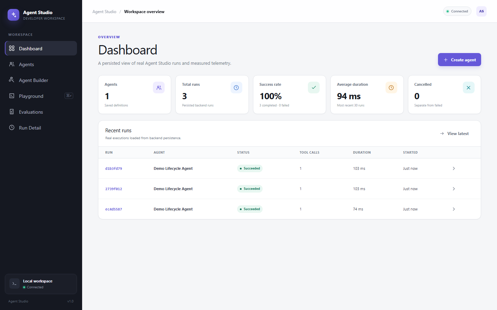
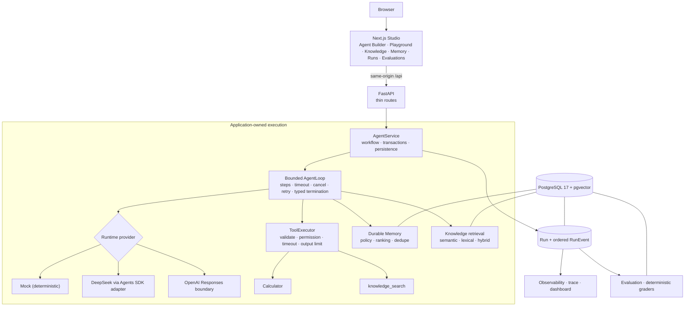

# Agent Studio

**English** | [简体中文](README.zh-CN.md)

**A full-stack workbench for building, running, and debugging tool-using AI agents.**
Every step, tool call, retrieval, and Memory write is persisted as an ordered Run event, so a Run can
be explained and evaluated after the fact instead of guessed at from a chat transcript.

A local, single-user Agent application platform. Not a chatbot UI, not a framework, not a managed
service.

[](https://github.com/kallist/agent-studio/actions/workflows/ci.yml)
[](https://github.com/kallist/agent-studio/actions/workflows/delivery.yml)
[](LICENSE)


**Quick links:** [Quick start](#quick-start) · [Capabilities](#capabilities) ·
[Architecture](#architecture) · [Demo scenarios](#demo-scenarios) ·
[Limitations](#limitations) · [Documentation](#documentation)



## What Agent Studio is

Agent Studio runs an Agent end to end and keeps the evidence. You define an Agent, attach tools and a
knowledge base, give it durable Memory, run it in a playground, inspect the ordered trace, and then
score the result with deterministic graders. The same persisted Run and RunEvent records feed the live
trace, the dashboard, and Evaluation — they are one lineage, not three copies.

The default runtime is a deterministic Mock provider, so the whole product works with **no API key**.
An opt-in DeepSeek path has real online validation. The OpenAI Responses boundary is implemented but
its live execution is **NOT TESTED**.

## Why this exists

Debugging agent behavior is hard when execution policy lives in an SDK, tool calls are invisible,
retrieval is unauditable, and evaluation is a separate script with its own copy of the truth. Agent
Studio puts those concerns behind explicit application boundaries and persists the evidence needed to
explain a result:

- Limits, cancellation, retries, tool permissions, and terminal state belong to the **application**, so
  swapping providers cannot silently change product behavior.
- A failed or in-progress knowledge re-ingestion must never leak into retrieval, so retrieval only sees
  **completed** ingestion generations.
- Memory writes must stay reproducible under concurrency, so policy ordering is enforced by a
  **serialized transaction** rather than by hope.

## Capabilities

| Area | What it does | Status |
|---|---|---|
| Agent runtime | Application-owned bounded loop: step limit, total timeout, cancellation, invalid-output retry, typed termination | IMPLEMENTED · TESTED |
| Tool calling | Server-owned registry; schema validation, permissions, per-tool call limits, timeouts, output limits, audit events | IMPLEMENTED · TESTED |
| RAG | Async ingestion, semantic / lexical / hybrid retrieval, completed-only visibility, server-owned citations | IMPLEMENTED · TESTED |
| Durable Memory | Agent-scoped policy, ranking, dedupe, expiration, deletion, transaction ordering | IMPLEMENTED · TESTED |
| Observability | Persisted `Run` and ordered `RunEvent`, trace UI, usage and latency projections | IMPLEMENTED · TESTED |
| Evaluation | Real isolated Runs, deterministic graders, PASS / FAIL / ERROR, reproducible results | IMPLEMENTED · TESTED |
| Persistence | PostgreSQL 17 with pgvector `vector(256)` + HNSW (Docker); SQLite for host development | IMPLEMENTED · TESTED |
| Providers | Mock (default, no key); DeepSeek Chat Completions | IMPLEMENTED · REAL TESTED |
| Providers | OpenAI Responses and OpenAI embeddings boundaries | IMPLEMENTED · LIVE NOT TESTED |
| Delivery | Non-root read-only Docker runtime; CI and Delivery Validation gates | IMPLEMENTED · TESTED |
| UI language | Typed `en` / `zh-CN` localization with a global switcher | IMPLEMENTED · TESTED |

Each claim, its evidence, and its limitation are tracked in the
[v1 source-of-truth matrix](docs/V1_STATUS.md).

## Architecture



The frontend never calls a provider or a tool directly, and the browser never receives database or
provider credentials. Read [Architecture](docs/ARCHITECTURE.md) for the contracts and
[Run lifecycle](docs/RUN_LIFECYCLE.md) for the step-by-step execution sequence.

## Engineering highlights

- **The application owns the AgentLoop.** `AgentRuntime` is a port; `AgentLoop` owns step limits,
  timeout, cancellation, duplicate-call policy, event ordering, and terminal mapping. SDK objects and
  raw streams stop at the adapter, so Mock and real providers run the same product path.
- **The model never executes a tool.** SDK callbacks are capture-only. A captured call becomes an
  application `ToolCall` that only `ToolExecutor` may validate and run, with per-tool call limits and
  duplicate-call suppression.
- **Completed-only RAG.** Chunks are staged under a generation with a disjoint index range and
  activated in one transaction; semantic search, lexical search, and citation hydration each
  independently require a `completed` generation, so failed or orphaned data stays invisible.
- **Durable Memory with real concurrency semantics.** Disable and Run finalization serialize on one
  database-owned Agent row (`SELECT ... FOR UPDATE` on PostgreSQL, `BEGIN IMMEDIATE` on SQLite), giving
  deterministic disable-wins and finalization-wins orderings instead of duplicate or
  policy-inconsistent writes.
- **One lineage for trace, dashboard, and Evaluation.** `Run` plus ordered `RunEvent` is the source of
  truth; dashboards and Evaluation are projections. Evaluation executes real isolated Runs and is
  excluded from normal dashboard metrics so regression traffic cannot distort usage numbers.
- **A production-like local stack.** Loopback-only bindings, internal-only PostgreSQL, non-root
  read-only application containers, bounded logs, runtime secret volumes, and fail-closed readiness.
  There is no silent provider fallback and no silent SQLite fallback.

## Quick start

Prerequisite: Docker Desktop, or Docker Engine with Docker Compose.

```bash
git clone https://github.com/kallist/agent-studio.git
cd agent-studio
docker compose up --build -d
```

Open <http://127.0.0.1:3000>. **No API key is required.** The stack runs the production Next.js server,
one Uvicorn API process, and PostgreSQL 17 with pgvector.

On Windows, the checked helper validates the daemon, ports, provider configuration, the Compose model,
and health before reporting success:

```powershell
.\scripts\docker-up.ps1
.\scripts\docker-down.ps1
```

Normal shutdown preserves PostgreSQL, uploaded knowledge sources, and runtime-secret volumes.
`docker-down.ps1 -PurgeData` is deliberately destructive and requires typing an exact project-name
confirmation.

A fresh database starts empty. The [demo scenarios](#demo-scenarios) below create everything you need
in about five minutes; the full click-by-click script is [docs/DEMO.md](docs/DEMO.md).

The commands above were verified against this revision on a clean checkout: the stack reported
`api` and `db` healthy, `/health` returned `200`, the same-origin `/api` proxy worked, and a Mock Agent
created through the API completed `Calculate 128 * 37 + 456` with output `5192` and the ordered event
sequence documented in [Run lifecycle](docs/RUN_LIFECYCLE.md) — with no provider key configured.

## Demo scenarios

| # | Do this | You should see |
|---|---|---|
| 1 | In **Agent Builder**, create knowledge base `Agent Studio Demo KB`, upload [the demo document](docs/demo/agent-studio-demo-knowledge.md), and wait for `completed` | Document state reaches `completed`; a retrieval test ranks the source first |
| 2 | Save an Agent named `Demo Lifecycle Agent` with **Mock**, Calculator, Durable Memory, and that knowledge base | Playground opens and labels the runtime as deterministic Mock |
| 3 | Run `Calculate 128 * 37 + 456` | Final answer `5192`, plus Tool selected → Tool call → Tool result in the trace. Usage is N/A because Mock issues no model request |
| 4 | Run `Remember that my preferred demo environment is PostgreSQL.`, then `What demo environment do I prefer, and what recovery codename does the handbook use?` | `Memory written`, then `Memory retrieved` plus a knowledge citation naming `Glacier-5192` and PostgreSQL 17 |
| 5 | Open **Run detail** and switch the trace filters | Status, duration, steps, terminal reason, and ordered events survive a page refresh |
| 6 | In **Evaluations**, create a suite expecting text `5192` and tool `calculator`, then run it | PASS with a link to the real evaluation Run it graded |
| 7 | Finish on **Dashboard** | Persisted normal Runs and measured telemetry; evaluation traffic is excluded |

If demo records already exist, skip steps 1–2 and run steps 3–7 in about two minutes.

## Model providers

| Provider | Default | Live validation | Notes |
|---|---|---|---|
| `mock` | yes | n/a (deterministic, no network) | Full product path without a key. Usage is N/A, not zero |
| `deepseek` | opt-in | **Real online validation** | Streamed Chat Completions, official base URL, its own server-side key. Billable and nondeterministic, so it is not a merge gate |
| `openai` | opt-in | **NOT TESTED** | Responses and embeddings boundaries are implemented and covered by offline contract tests only |

For the Docker runtime, pass the key to the host process only:

```powershell
.\scripts\docker-up.ps1 -Provider deepseek
```

The helper streams the value over stdin into a project-scoped, API-only secret volume. The key is never
a build argument, a source file, a command-line value, or a persistent container environment value.
OpenAI has an equivalent `-Provider openai` path whose live behavior remains **NOT TESTED**.

See [Model providers](docs/MODEL_PROVIDERS.md) and [Configuration](docs/CONFIGURATION.md).

## Quality and validation

Measured in this repository at `main` (`ea90bbd`), before the packaging changes:

- **Backend:** 232 tests collected; the default offline selection runs **206 passed, 26 deselected**
  (provider, PostgreSQL, and performance cases are opt-in). Ruff and strict `mypy` clean.
- **PostgreSQL:** the same suites run against real PostgreSQL 17 + pgvector 0.8.6, asserting the real
  vector extension, `vector(256)`, HNSW, row-lock interleavings, and completed-only visibility.
- **Frontend:** **31 Vitest tests passed** across 5 files, strict TypeScript, ESLint, and a webpack
  production build.
- **Browser:** 18 deterministic Mock-only Playwright scenarios, plus explicit DeepSeek and OpenAI
  suites that are not part of the default gate.
- **Docker:** Compose validation, clean production image builds, and a non-root user assertion for both images.
- **Quick start:** executed on a clean checkout against this revision — fresh Compose stack reached
  healthy, `/health` returned `200`, the same-origin `/api` proxy served the API, and an API-created Mock
  Agent ran `Calculate 128 * 37 + 456` to `5192` with no provider key configured.
- **Reliability:** bounded recovery, concurrency, timeout, cancellation, and project-scoped container
  restart/persistence validation.
- **Performance:** a synthetic PostgreSQL/pgvector baseline (nine scenarios reporting p50/p95 and
  throughput) with deliberately wide catastrophic-regression thresholds, because GitHub-hosted runners
  are noisy. These are engineering regression numbers measured on one Windows machine on Mock, not a
  capacity claim, not real-provider latency, and not an SLA — see
  [docs/performance-baseline.json](docs/performance-baseline.json).

```powershell
.\.venv\Scripts\ruff.exe check apps/api scripts/ci
.\.venv\Scripts\mypy.exe apps/api/app
.\.venv\Scripts\pytest.exe apps/api/tests -m "not postgresql and not real_openai and not real_deepseek and not performance" -q
pnpm --dir apps/web test:run
pnpm --dir apps/web typecheck
pnpm --dir apps/web lint
pnpm --dir apps/web build --webpack
pnpm --dir apps/web e2e
```

CI runs independent Backend, PostgreSQL, Frontend, Playwright, Docker, Reliability, and Performance
jobs. Delivery Validation additionally builds fresh production images and exercises startup,
Calculator, RAG/pgvector, Memory, Evaluation, persistence/recovery, and container-targeted E2E. It
publishes validation evidence only — no registry image and no public deployment.

## Tech stack

| Layer | Technology |
|---|---|
| Frontend | Next.js (App Router), React, TypeScript strict, Tailwind CSS |
| Backend | Python 3.12, FastAPI, Pydantic, SQLAlchemy async |
| Agent | Application-owned `AgentLoop`, tool registry/executor, OpenAI Agents SDK behind an adapter |
| Data | PostgreSQL 17 (Docker), SQLite (host development fallback) |
| Vector | pgvector 0.8.6, `vector(256)`, HNSW, deterministic local embeddings |
| Providers | Mock (default), DeepSeek Chat Completions, OpenAI Responses boundary |
| Infra | Docker Compose, non-root production images, GitHub Actions |
| Testing | pytest, Vitest, React Testing Library, Playwright |

## Project structure

```text
apps/api/          FastAPI modular monolith
  app/runtime/       AgentLoop, provider adapters, Mock
  app/tools/         tool registry, validation, Calculator, knowledge_search
  app/knowledge/     ingestion, chunking, embeddings, vector store, retrieval
  app/memory/        Memory policy, keys, store
  app/evaluation/    suites, graders, worker, aggregation
  app/observability/ redaction, metrics projection
  app/api/           HTTP routes
  app/application/   AgentService workflows
  app/domain/        contracts, errors, ports
  app/persistence/   SQLAlchemy models, repositories, runtime secrets
apps/web/          Next.js Studio: App Router, components, i18n dictionaries, Playwright specs
docs/              architecture, design, operations, and ADRs
scripts/           Docker helper and CI validation scripts
infra/             local PostgreSQL/pgvector init assets
.github/workflows/ CI, Delivery Validation, manual provider live validation
```

## Documentation

Where to start depends on what you need:

| I want to… | Read |
|---|---|
| Understand why it is built this way | [Engineering case study](docs/CASE_STUDY.md) · [Architecture](docs/ARCHITECTURE.md) · [Runtime ADR](docs/ADR/001-agent-runtime.md) |
| Follow one execution or one ingestion | [Run lifecycle](docs/RUN_LIFECYCLE.md) · [RAG lifecycle](docs/RAG_LIFECYCLE.md) |
| Go deep on a subsystem | [RAG](docs/RAG_DESIGN.md) · [Memory](docs/MEMORY_DESIGN.md) · [Observability](docs/OBSERVABILITY_DESIGN.md) · [Evaluation](docs/EVALUATION_DESIGN.md) |
| Check a capability claim | [v1 status matrix](docs/V1_STATUS.md) · [CI, reliability, and performance](docs/CI_RELIABILITY_PERFORMANCE.md) |
| Operate or configure it | [Container runtime](docs/CONTAINER_RUNTIME.md) · [PostgreSQL + pgvector](docs/POSTGRESQL_PGVECTOR.md) · [Configuration](docs/CONFIGURATION.md) |
| Run it or demo it | [Development](docs/DEVELOPMENT.md) · [Demo script](docs/DEMO.md) · [UI internationalization](docs/I18N.md) |
| Review providers, security, or the UI language layer | [Model providers](docs/MODEL_PROVIDERS.md) · [OpenAI integration](docs/OPENAI_INTEGRATION.md) · [Security design](docs/SECURITY_DESIGN.md) |
| See release and repository metadata | [Release notes v1.0](docs/RELEASE_NOTES_v1.0.md) · [Changelog](CHANGELOG.md) · [GitHub presentation notes](docs/GITHUB_PRESENTATION.md) · [Security policy](SECURITY.md) |

## Limitations

Agent Studio v1 is a **single-user local development workbench** and must not be exposed as a public or
shared service.

- Authentication, authorization, RBAC, multi-tenancy, and global rate limiting: **NOT IMPLEMENTED**.
- Horizontal or multiprocess API operation, and managed PostgreSQL: **NOT TESTED**. The Compose stack
  runs one API process because ingestion and Evaluation workers are application-local.
- Distributed workers, Kubernetes, public TLS/ingress, backup automation, and cloud secret management:
  **NOT IMPLEMENTED**.
- Real OpenAI Responses, OpenAI embeddings, OpenAI with pgvector, and internet production load:
  **NOT TESTED**.
- Chaos engineering, high availability, zero-downtime delivery, and any production SLA:
  **NOT IMPLEMENTED / NOT CLAIMED**.
- Ingestion accepts plain text, Markdown, and text-extractable PDF only. Retrieval quality is not
  benchmarked against published datasets.

See [v1 status and limitations](docs/V1_STATUS.md) and [Security design](docs/SECURITY_DESIGN.md).

## License

[MIT](LICENSE).
