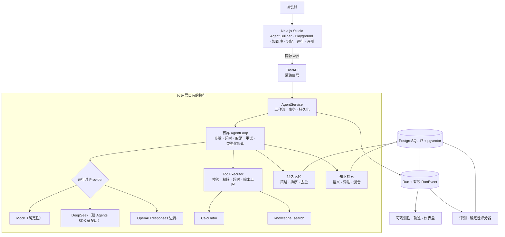

# Agent Studio

[English](README.md) | **简体中文**

**面向工具调用型 AI Agent 的全栈开发与调试工作台。**
每一步、每次工具调用、每条检索结果与记忆写入都会以有序 Run 事件持久化，因此一次运行可以被解释和
评测，而不是只能从聊天记录里猜测。

一个面向本地、单用户的 Agent 应用平台。它不是一个聊天界面，不是一个框架，也不是托管服务。

[](https://github.com/kallist/agent-studio/actions/workflows/ci.yml)
[](https://github.com/kallist/agent-studio/actions/workflows/delivery.yml)
[](LICENSE)


**快速导航：**[快速开始](#快速开始) · [核心能力](#核心能力) · [系统架构](#系统架构) ·
[演示场景](#演示场景) · [已知限制](#已知限制) · [文档](#文档)

<details>
<summary>全部章节</summary>

[Agent Studio 是什么](#agent-studio-是什么) · [为什么做这个项目](#为什么做这个项目) ·
[核心能力](#核心能力) · [系统架构](#系统架构) · [工程要点](#工程要点) ·
[快速开始](#快速开始) · [演示场景](#演示场景) · [模型 Provider](#模型-provider) ·
[质量与验证](#质量与验证) · [技术栈](#技术栈) · [项目结构](#项目结构) ·
[文档](#文档) · [已知限制](#已知限制) · [许可证](#许可证)

</details>


## Agent Studio 是什么

Agent Studio 完整地运行一个 Agent，并把证据保留下来。你可以定义 Agent、挂载工具与知识库、为它启用
持久记忆，在 Playground 中运行，检查有序的执行轨迹，再用确定性评分器给结果打分。实时轨迹、仪表盘与
评测读取的是同一份持久化的 `Run` 与 `RunEvent` 记录——它们是同一条事实来源，而不是三份副本。

默认运行时是确定性 Mock Provider，因此整个产品**无需任何 API Key** 即可使用。可选启用的 DeepSeek
路径经过真实在线验证；OpenAI Responses 边界已实现，但**实时调用未经验证（NOT TESTED）**。

## 为什么做这个项目

当执行策略藏在 SDK 里、工具调用不可见、检索无法审计、评测又是另一套自带副本的脚本时，Agent 的行为就
很难被调试。Agent Studio 把这些关注点放到明确的应用层边界之后，并持久化解释一次结果所需要的证据：

- 步数限制、取消、重试、工具权限与终止状态属于**应用层**，因此更换 Provider 不会悄悄改变产品行为。
- 失败或进行中的知识库重新摄入绝不允许泄漏进检索，因此检索只能看到**已完成（completed）**的摄入代次。
- 记忆写入在并发下必须可复现，因此策略顺序由**串行化事务**保证，而不是靠运气。

## 核心能力

| 领域 | 具体能力 | 状态 |
|---|---|---|
| Agent 运行时 | 应用层有界循环：步数上限、总超时、取消、无效输出重试、类型化终止 | 已实现 · 已测试 |
| 工具调用 | 服务端自有注册表；参数校验、权限、单工具调用上限、超时、输出上限、审计事件 | 已实现 · 已测试 |
| RAG | 异步摄入、语义 / 词法 / 混合检索、completed-only 可见性、服务端自有引用来源 | 已实现 · 已测试 |
| 持久记忆 | Agent 级策略、排序、去重、过期、删除、事务顺序 | 已实现 · 已测试 |
| 可观测性 | 持久化 `Run` 与有序 `RunEvent`、轨迹界面、用量与延迟投影 | 已实现 · 已测试 |
| 评测 | 真实隔离运行、确定性评分器、PASS / FAIL / ERROR、结果可复现 | 已实现 · 已测试 |
| 持久化 | Docker 下使用 PostgreSQL 17 与 pgvector `vector(256)` + HNSW；本机开发用 SQLite | 已实现 · 已测试 |
| Provider | Mock（默认，无需 Key）；DeepSeek Chat Completions | 已实现 · 真实测试 |
| Provider | OpenAI Responses 与 OpenAI embeddings 边界 | 已实现 · 实时未测试 |
| 交付 | 非 root 只读 Docker 运行时；CI 与 Delivery Validation 门禁 | 已实现 · 已测试 |
| 界面语言 | 类型化 `en` / `zh-CN` 双语与全局语言切换 | 已实现 · 已测试 |

每一项声明、对应证据与限制记录在 [v1 事实来源矩阵](docs/V1_STATUS.md)。

## 系统架构



前端从不直接调用 Provider 或工具，浏览器也不会拿到数据库或 Provider 凭据。契约说明见
[架构文档](docs/ARCHITECTURE.md)，逐步执行时序见[运行生命周期](docs/RUN_LIFECYCLE.md)。

## 工程要点

- **应用层拥有 AgentLoop。** `AgentRuntime` 是一个端口；步数上限、超时、取消、重复调用策略、事件顺序
  与终止映射全部由 `AgentLoop` 掌握。SDK 对象与原始流止步于适配层，因此 Mock 与真实 Provider 走的是
  同一条产品路径。
- **模型永远不会执行工具。** SDK 回调是 capture-only。被捕获的调用会变成应用层的 `ToolCall`，只有
  `ToolExecutor` 可以校验并执行它，并受单工具调用上限与重复调用抑制约束。
- **completed-only RAG。** 分块先以互不相交的索引区间按代次暂存，再在单个事务内激活；语义检索、词法
  检索与引用水合各自独立要求所属任务为 `completed`，因此失败或孤儿数据永远不会可见。
- **具备真实并发语义的持久记忆。** 记忆开关变更与运行终结在同一个 Agent 归属行上串行化
  （PostgreSQL 用 `SELECT ... FOR UPDATE`，SQLite 用 `BEGIN IMMEDIATE`），使 disable-wins 与
  finalization-wins 成为确定行为，而不是重复或违反策略的写入。
- **轨迹、仪表盘与评测共用一条谱系。** `Run` 加有序 `RunEvent` 是事实来源，仪表盘与评测都是投影。
  评测执行真实隔离运行，并被排除在常规仪表盘指标之外，因此回归流量不会扭曲使用数据。
- **贴近生产的本地栈。** 仅回环绑定、数据库仅内网可达、应用容器非 root 只读、日志有界、运行时密钥卷、
  就绪检查 fail-closed。既不会静默回退 Provider，也不会静默回退 SQLite。

## 快速开始

前置条件：Docker Desktop，或带 Docker Compose 的 Docker Engine。

```bash
git clone https://github.com/kallist/agent-studio.git
cd agent-studio
docker compose up --build -d
```

打开 <http://127.0.0.1:3000>。**无需任何 API Key。** 该栈会运行生产构建的 Next.js 服务、一个 Uvicorn
API 进程，以及带 pgvector 的 PostgreSQL 17。

在 Windows 上，仓库内附带的脚本会先校验守护进程、端口、Provider 配置、Compose 模型与健康状态，再报告成功：

```powershell
.\scripts\docker-up.ps1
.\scripts\docker-down.ps1
```

正常关闭会保留 PostgreSQL、已上传的知识源与运行时密钥卷。`docker-down.ps1 -PurgeData` 是**刻意设计的
破坏性操作**，需要输入精确的项目名确认。

全新数据库启动后是空的。下面的[演示场景](#演示场景)可在约五分钟内创建出全部所需数据；完整分步脚本见
[docs/DEMO.md](docs/DEMO.md)。

上面的命令已在干净检出上、针对本次修订实际验证：`api` 与 `db` 报告健康，`/health` 返回 `200`，同源
`/api` 代理正常工作，通过 API 创建的 Mock Agent 执行 `Calculate 128 * 37 + 456` 得到 `5192`，且事件
顺序与[运行生命周期](docs/RUN_LIFECYCLE.md)记录一致——全程未配置任何 Provider 密钥。

## 演示场景

| # | 操作 | 预期结果 |
|---|---|---|
| 1 | 在 **Agent Builder** 中创建知识库 `Agent Studio Demo KB`，上传[演示文档](docs/demo/agent-studio-demo-knowledge.md)，等待 `completed` | 文档状态变为 `completed`；检索测试中该来源排名第一 |
| 2 | 保存名为 `Demo Lifecycle Agent` 的 Agent，选择 **Mock**，启用 Calculator、Durable Memory 与该知识库 | 自动进入 Playground，并明确标注运行时为确定性 Mock |
| 3 | 运行 `Calculate 128 * 37 + 456` | 最终答案为 `5192`，轨迹中出现 Tool selected → Tool call → Tool result。用量显示为 N/A，因为 Mock 不发起模型请求 |
| 4 | 先运行 `Remember that my preferred demo environment is PostgreSQL.`，再运行 `What demo environment do I prefer, and what recovery codename does the handbook use?` | 先出现 `Memory written`，随后出现 `Memory retrieved`，并带有引用来源 `Glacier-5192` 与 PostgreSQL 17 |
| 5 | 打开 **Run detail** 并切换轨迹过滤器 | 状态、耗时、步数、终止原因与有序事件在刷新后依然存在 |
| 6 | 在 **Evaluations** 中创建期望文本 `5192`、期望工具 `calculator` 的用例并运行 | 显示 PASS，并可链接到它所评分的真实运行 |
| 7 | 最后停留在 **Dashboard** | 看到持久化的常规运行与实测遥测；评测流量被排除在外 |

如果演示数据已存在，可跳过第 1–2 步，第 3–7 步约两分钟即可完成。

## 模型 Provider

| Provider | 默认 | 实时验证 | 说明 |
|---|---|---|---|
| `mock` | 是 | 不适用（确定性、无网络） | 无需 Key 即可跑通完整产品路径。用量显示为 N/A，而不是 0 |
| `deepseek` | 可选 | **真实在线验证** | 流式 Chat Completions、官方 Base URL、独立的服务端密钥。会产生费用且结果不确定，因此不作为合并门禁 |
| `openai` | 可选 | **未测试（NOT TESTED）** | Responses 与 embeddings 边界已实现，但仅有离线契约测试覆盖 |

在 Docker 运行时中，密钥只交给宿主进程：

```powershell
.\scripts\docker-up.ps1 -Provider deepseek
```

该脚本把密钥经 stdin 写入项目专属的 API-only 密钥卷。密钥绝不会成为构建参数、源码文件、命令行参数或
持久化的容器环境变量。OpenAI 有等价路径 `-Provider openai`，但其实时行为同样标注为 **未测试**。

详见[模型 Provider](docs/MODEL_PROVIDERS.md) 与[配置说明](docs/CONFIGURATION.md)。

## 质量与验证

以下数字在本次打包改动之前、基于本仓库 `main`（`ea90bbd`）实测：

- **后端：** 共收集 232 个测试；默认离线选择**通过 206 个、按标记排除 26 个**（Provider、PostgreSQL 与
  性能用例需要显式启用）。Ruff 与严格模式 `mypy` 通过。
- **PostgreSQL：** 同一批用例会在真实 PostgreSQL 17 + pgvector 0.8.6 上运行，校验真实的向量扩展、
  `vector(256)`、HNSW、行锁交错顺序与 completed-only 可见性。
- **前端：** **Vitest 31 项测试通过**（5 个文件）、严格 TypeScript、ESLint 与 webpack 生产构建。
- **浏览器：** 18 个确定性 Mock-only Playwright 场景；另有 DeepSeek 与 OpenAI 专属套件，不属于默认门禁。
- **Docker：** Compose 校验、干净的生产镜像构建，以及两个镜像的非 root 用户断言。
- **可靠性：** 有界恢复、并发、超时、取消，以及项目作用域内的容器重启与持久化验证。
- **性能：** 一套合成的 PostgreSQL/pgvector 基线（九个场景，报告 p50/p95 与吞吐），阈值刻意设得很宽，
  因为 GitHub 托管运行器噪声较大。这些是单台 Windows 机器上、基于 Mock 的回归观测值，不是容量承诺、
  不是真实 Provider 延迟，也不是 SLA——见 [docs/performance-baseline.json](docs/performance-baseline.json)。

```powershell
.\.venv\Scripts\ruff.exe check apps/api scripts/ci
.\.venv\Scripts\mypy.exe apps/api/app
.\.venv\Scripts\pytest.exe apps/api/tests -m "not postgresql and not real_openai and not real_deepseek and not performance" -q
pnpm --dir apps/web test:run
pnpm --dir apps/web typecheck
pnpm --dir apps/web lint
pnpm --dir apps/web build --webpack
pnpm --dir apps/web e2e
```

CI 由 Backend、PostgreSQL、Frontend、Playwright、Docker、Reliability、Performance 七个相互独立的作业
组成。Delivery Validation 还会用全新构建的生产镜像演练启动、Calculator、RAG/pgvector、记忆、评测、
持久化与恢复，以及面向容器的 E2E。它只产出验证证据——不推送镜像仓库，也不做任何公开部署。

## 技术栈

| 层次 | 技术 |
|---|---|
| 前端 | Next.js（App Router）、React、TypeScript strict、Tailwind CSS |
| 后端 | Python 3.12、FastAPI、Pydantic、SQLAlchemy async |
| Agent | 应用层自有 `AgentLoop`、工具注册表/执行器、位于适配层之后的 OpenAI Agents SDK |
| 数据 | PostgreSQL 17（Docker）、SQLite（本机开发回退） |
| 向量 | pgvector 0.8.6、`vector(256)`、HNSW、确定性本地 embeddings |
| Provider | Mock（默认）、DeepSeek Chat Completions、OpenAI Responses 边界 |
| 基础设施 | Docker Compose、非 root 生产镜像、GitHub Actions |
| 测试 | pytest、Vitest、React Testing Library、Playwright |

## 项目结构

```text
apps/api/          FastAPI 模块化单体
  app/runtime/       AgentLoop、Provider 适配层、Mock
  app/tools/         工具注册表、校验、Calculator、knowledge_search
  app/knowledge/     摄入、分块、embeddings、向量存储、检索
  app/memory/        记忆策略、键、存储
  app/evaluation/    评测套件、评分器、工作器、聚合
  app/observability/ 脱敏、指标投影
  app/api/           HTTP 路由
  app/application/   AgentService 工作流
  app/domain/        契约、错误、端口
  app/persistence/   SQLAlchemy 模型、仓储、运行时密钥
apps/web/          Next.js Studio：App Router、组件、i18n 词典、Playwright 用例
docs/              架构、设计、运维与 ADR
scripts/           Docker 辅助脚本与 CI 校验脚本
infra/             本地 PostgreSQL/pgvector 初始化资源
.github/workflows/ CI、Delivery Validation、手动 Provider 实时验证
```

## 文档

可以按需求选择入口：

| 我想…… | 阅读 |
|---|---|
| 理解为什么这样设计 | [工程案例研究](docs/CASE_STUDY.md) · [架构](docs/ARCHITECTURE.md) · [运行时 ADR](docs/ADR/001-agent-runtime.md) |
| 跟随一次运行或一次知识摄入 | [运行生命周期](docs/RUN_LIFECYCLE.md) · [RAG 生命周期](docs/RAG_LIFECYCLE.md) |
| 深入某个子系统 | [RAG 设计](docs/RAG_DESIGN.md) · [记忆设计](docs/MEMORY_DESIGN.md) · [可观测性](docs/OBSERVABILITY_DESIGN.md) · [评测](docs/EVALUATION_DESIGN.md) |
| 核对某项能力声明 | [v1 状态矩阵](docs/V1_STATUS.md) · [CI、可靠性与性能](docs/CI_RELIABILITY_PERFORMANCE.md) |
| 配置或运维 | [容器运行时](docs/CONTAINER_RUNTIME.md) · [PostgreSQL + pgvector](docs/POSTGRESQL_PGVECTOR.md) · [配置](docs/CONFIGURATION.md) |
| 运行或演示 | [开发](docs/DEVELOPMENT.md) · [演示脚本](docs/DEMO.md) · [界面国际化](docs/I18N.md) |
| 了解 Provider、安全与界面语言层 | [模型 Provider](docs/MODEL_PROVIDERS.md) · [OpenAI 集成](docs/OPENAI_INTEGRATION.md) · [安全设计](docs/SECURITY_DESIGN.md) |
| 查看发布与仓库元数据 | [v1.0 发布说明](docs/RELEASE_NOTES_v1.0.md) · [变更日志](CHANGELOG.md) · [GitHub 展示建议](docs/GITHUB_PRESENTATION.md) |

## 已知限制

Agent Studio v1 是一个**单用户本地开发工作台**，不得作为公开或共享服务对外暴露。

- 认证、授权、RBAC、多租户与全局限流：**未实现**。
- 多进程或水平扩展的 API，以及托管 PostgreSQL：**未测试**。Compose 栈只运行一个 API 进程，因为摄入与
  评测工作器都是应用进程内的。
- 分布式工作器、Kubernetes、公网 TLS/入口、备份自动化与云密钥管理：**未实现**。
- 真实 OpenAI Responses、OpenAI embeddings、OpenAI 与 pgvector 组合，以及互联网生产负载：**未测试**。
- 混沌工程、高可用、零停机交付与任何生产 SLA：**未实现 / 不作任何声明**。
- 摄入仅支持纯文本、Markdown 与可提取文本的 PDF。检索质量未与公开数据集做过基准对比。

详见 [v1 状态与限制](docs/V1_STATUS.md) 与[安全设计](docs/SECURITY_DESIGN.md)。

## 许可证

[MIT](LICENSE)。
