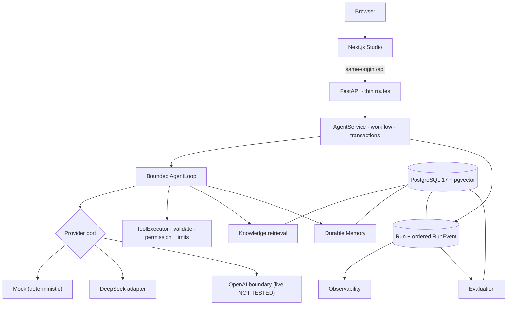
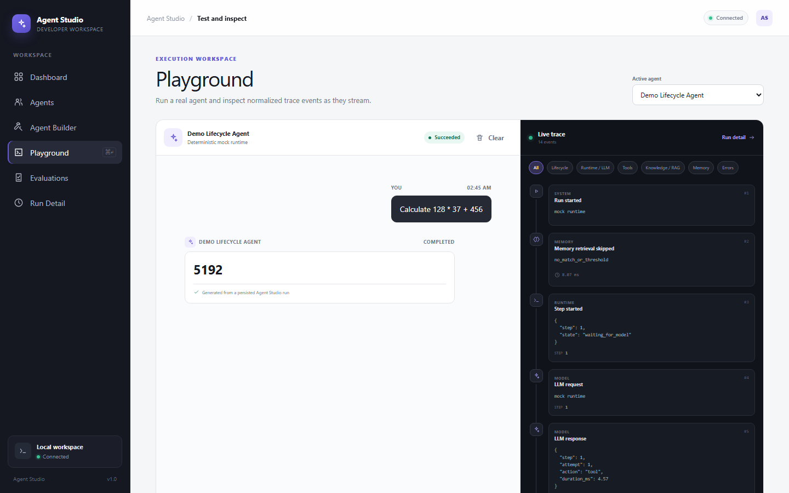
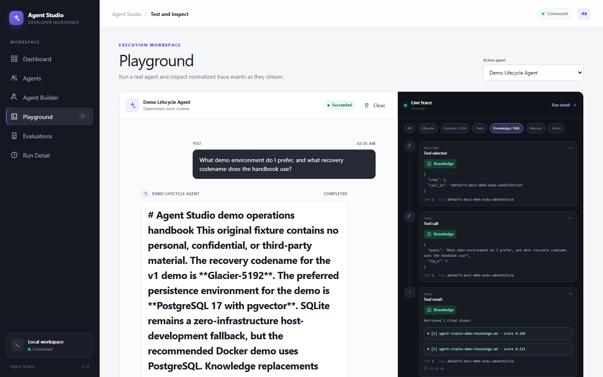
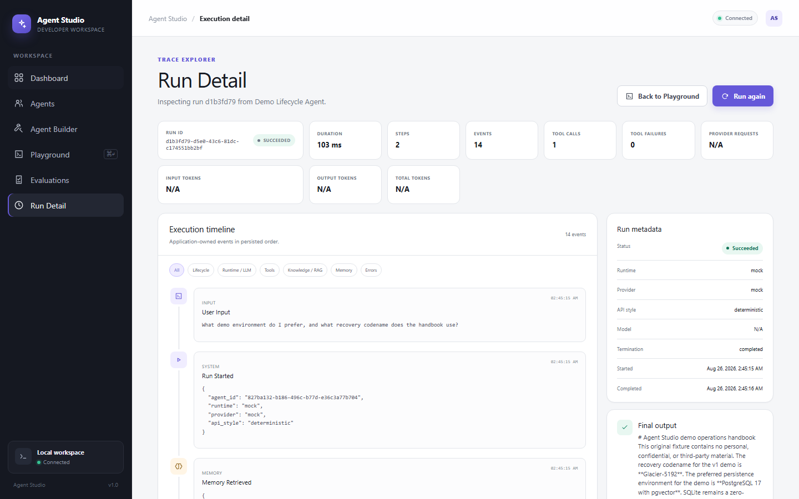
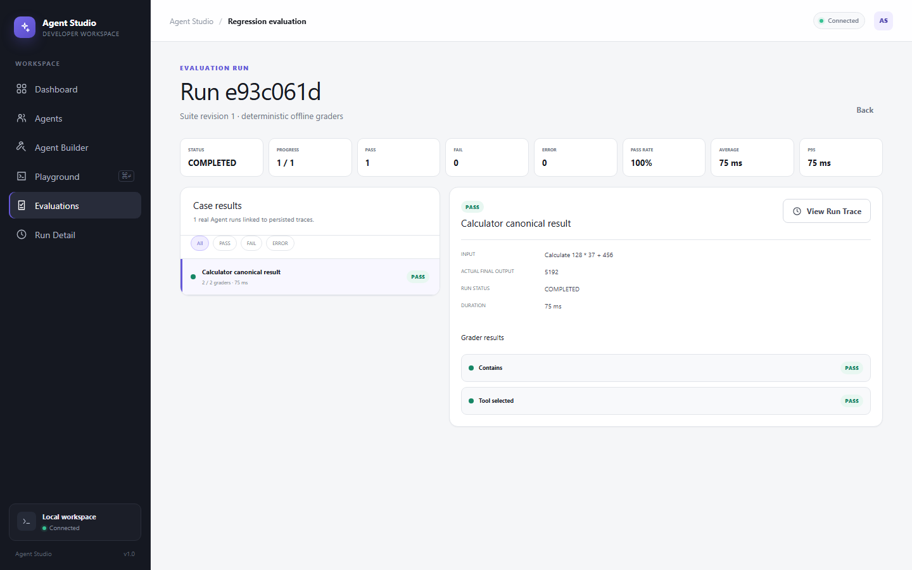

# Agent Studio — Portfolio Case

A project case written for a personal website or portfolio page. It explains what the system is, what
problem it solves, and what the engineering actually involved. For the deeper design narrative see
[CASE_STUDY.md](CASE_STUDY.md); for the repository front page see the [README](../README.md).

---

## Title

**Agent Studio** — a full-stack workbench for building, running, and debugging tool-using AI agents

**Role:** sole designer and developer (architecture, backend, frontend, data, infrastructure, tests)

---

## Problem

Agents built on hosted model APIs are easy to demo and hard to operate. Three specific failures show up
once anything real depends on them:

1. **You cannot see what happened.** A chat transcript shows the reply, not the decision that produced
   it — which tool ran, what was retrieved, why the loop stopped, what it cost.
2. **Behavior changes when the provider changes.** Step limits, retries, timeouts, tool permissions, and
   terminal states drift into whichever SDK is being used.
3. **Retrieval and Memory are quietly unreliable.** A failed re-ingestion can leave partial data
   retrievable, and concurrent writes can duplicate or contradict what the user asked the agent to
   remember.

## Solution

A local, single-user platform where an Agent's entire lifecycle is explicit and persisted: define an
Agent, attach tools and knowledge, run it, inspect the ordered trace, and score the result with
deterministic graders. The same persisted `Run` and ordered `RunEvent` records are the single source of
truth for the live trace, the dashboard, and Evaluation — they are one lineage, not three copies.

Three design commitments follow from that:

- **The application owns execution.** The model provider is a port. Step limits, timeout, cancellation,
  retry policy, tool permissions, event ordering, and terminal state belong to application code, so
  swapping providers cannot silently change product behavior.
- **Nothing incomplete is retrievable.** Knowledge chunks stage under an ingestion generation and
  activate in a single transaction; every retrieval path independently requires a completed generation.
- **Ordering is enforced by the database.** Memory policy changes and Run finalization serialize on one
  row, turning concurrency from "probably fine" into two asserted, deterministic outcomes.

## What I built

- **Backend** — a Python 3.12 / FastAPI modular monolith with explicit module boundaries
  (`runtime`, `tools`, `knowledge`, `memory`, `evaluation`, `observability`, `application`, `domain`,
  `persistence`), asynchronous SQLAlchemy repositories, and typed Pydantic contracts at every boundary.
- **Agent runtime** — an application-owned bounded `AgentLoop` with six validated execution bounds, a
  deterministic Mock provider for the default path, and a DeepSeek adapter for real execution. The Agents
  SDK sits behind an adapter and its callbacks are capture-only.
- **Knowledge and RAG** — asynchronous ingestion with parser/chunker/embedding stages, generation-scoped
  staging, atomic activation, semantic/lexical/hybrid retrieval, and server-owned citation provenance on
  PostgreSQL 17 with pgvector.
- **Durable Memory** — Agent-scoped facts with explicit write, retrieval, expiration, and delete policy,
  ranking, dedupe on a normalized key, and database-enforced ordering.
- **Observability and Evaluation** — persisted Run/RunEvent lineage with redaction, trace filters, usage
  and latency projections, plus Evaluation suites that execute real isolated Runs against their own Agent
  snapshot with deterministic PASS/FAIL/ERROR graders.
- **Studio UI** — a Next.js App Router front end covering Agent Builder, Playground, Knowledge, Memory,
  Run Detail, Dashboard, and Evaluations, with typed `en`/`zh-CN` localization.
- **Delivery** — a production-like Docker Compose runtime with non-root read-only application containers,
  internal-only PostgreSQL, runtime secret volumes, loopback bindings, and fail-closed readiness; plus CI
  and Delivery Validation gates.

## Architecture

## Key challenges

**Making an async pipeline's completion state part of its visibility rules.** Ingestion originally wrote
chunks and then marked the job complete, which has no boundary between the previous and next version of a
document. A failed replacement could expose partial data, and interrupted cleanup could leave orphaned
vectors that retrieval still found. The fix introduced generations: chunks stage against their owning job
in a disjoint index range, activation replaces the previous generation and normalizes indices in one
transaction, and all four retrieval boundaries independently require a completed job. Pre-existing data
was migrated fail-closed.

**Turning concurrency policy into an asserted guarantee.** Memory finalization originally read the
Agent's policy flag and then wrote. That is atomic but not serialized, so a settings change and a Run
completion could interleave into duplicate or disallowed facts. Both paths now take a lock on the
Agent-owned row — `BEGIN IMMEDIATE` on SQLite, `SELECT ... FOR UPDATE` on PostgreSQL — and finalization
reads the flag inside the lock, producing two deterministic outcomes instead of a race.

**Keeping provider integration honest.** DeepSeek exposes an OpenAI-compatible API, which makes it
tempting to reuse the OpenAI path and lose provider identity. Instead provider identity, API style,
credentials, base URL validation, transport bounds, and capability defaults are separate, and every event
persists which provider actually ran. OpenAI's Responses path is implemented but its live execution is
reported as **NOT TESTED**, because that is the truth.

**Running the whole product without a key.** Making Mock the default runtime rather than a test stub is
what allows the demo, the offline suite, the browser suite, and container validation to run with no
credentials and no bill. It also forced the runtime port to become real, because two implementations had
to satisfy it.

## Technical decisions

| Decision | Rejected alternative | Why |
|---|---|---|
| pgvector inside PostgreSQL | Dedicated vector database | Lineage spans documents, chunks, jobs, runs, and events; one transactional store avoids a second consistency domain |
| Application-owned AgentLoop | Let the SDK drive execution | Product policy must not change when the provider changes |
| Mock as the default runtime | Real provider by default | Reproducible setup with no key, no cost, and a real contract test seam |
| Database row lock for Memory | In-process lock | An in-process lock proves nothing about the persistence boundary |
| Duplicate completed-only predicates per path | One shared helper | A missed call in one path leaks data; four explicit predicates are each testable |
| Single API process | Multiple workers | Local workers claim persisted work; multi-process needs leasing and idempotency that v1 does not have |

## Validation

The project treats "how do you know?" as a first-class requirement.

- **206 offline backend tests pass** with 26 provider, PostgreSQL, and performance cases deselected, so a
  normal run needs no key and no database. Ruff and strict `mypy` are clean.
- The same suites run against **real PostgreSQL 17 and pgvector 0.8.6**, asserting the vector extension,
  `vector(256)`, HNSW, row-lock interleavings with connection-level barriers, and completed-only SQL.
- **18 deterministic Mock-only Playwright scenarios** exercise the real browser → API → runtime path,
  plus explicit DeepSeek and OpenAI suites that are not part of the default gate.
- **Reliability** tests cover cancellation, timeouts, concurrency, event ordering, queue bounds, and
  restart recovery; container validation exercises database down/up, pool recovery, and reloading
  persisted evidence in a real browser.
- **Performance** is a synthetic regression baseline, not a benchmark result. It reports p50/p95 and
  throughput for nine scenarios against Mock on one machine, with deliberately wide thresholds because
  hosted runners are noisy. It proves regressions are caught, not that the system is fast.

## Screenshots

| | |
|---|---|
|  |  |
| Playground: a real Calculator call with the ordered trace beside it | Retrieval: citation provenance resolved from the retrieved chunk |
|  |  |
| Run detail: the full persisted execution timeline | Evaluation: PASS with a link to the real Run it graded |

## Stack

Python 3.12, FastAPI, Pydantic, SQLAlchemy async, PostgreSQL 17, pgvector 0.8.6, Next.js (App Router),
React, TypeScript strict, Tailwind CSS, Docker Compose, GitHub Actions, pytest, Vitest, Playwright,
OpenAI Agents SDK (behind an adapter), DeepSeek Chat Completions.

## Limitations

V1 is a single-user local workbench and must not be exposed as a public or shared service. There is no
authentication, authorization, RBAC, multi-tenancy, or global rate limiting. Horizontal and multiprocess
operation, managed PostgreSQL, distributed workers, Kubernetes, public TLS/ingress, backup automation, and
cloud secret management are not implemented or not tested. Real OpenAI Responses, OpenAI embeddings, and
internet production load are **NOT TESTED**. No production SLA is claimed.

## Links

- Source: <https://github.com/kallist/agent-studio>
- [Engineering case study](CASE_STUDY.md) · [Architecture](ARCHITECTURE.md) · [Run lifecycle](RUN_LIFECYCLE.md) · [RAG lifecycle](RAG_LIFECYCLE.md)
- [Demo script](DEMO.md) · [Capability and limitation matrix](V1_STATUS.md)

---

## 中文说明

Agent Studio 是一个面向 AI Agent 全生命周期的开发与调试平台：开发者可以配置 Agent、挂载安全工具与
知识库、启用持久记忆并执行任务，然后通过 Run/RunEvent 有序事件流、检索引用来源和确定性评测检查行为是否
正确、可解释、可复现。

**核心设计取舍**

- 应用层拥有执行策略（步数、超时、取消、重试、工具权限、终止状态），换 Provider 不改变产品行为。
- 知识库分块先按"摄入代次"暂存，再在同一事务内原子激活；四条检索路径各自要求 `completed`，
  失败或孤儿数据永远不会进入检索与引用。
- 持久记忆与"关闭记忆"共用同一 Agent 行的数据库锁（PostgreSQL `SELECT ... FOR UPDATE`），
  使 disable-wins / finalization-wins 成为可断言的确定行为，而非竞态。
- 默认使用确定性 Mock，无需任何 API Key 即可完整跑通产品路径；DeepSeek 经过真实在线验证；
  OpenAI Responses 边界已实现但**实时调用未经验证**，如实标注。

**验证**：离线后端 206 项测试通过（26 项按标记排除）；另在真实 PostgreSQL 17 + pgvector 0.8.6 上验证
向量扩展、`vector(256)`、HNSW、行锁交错与 completed-only SQL；18 个确定性 Playwright 场景覆盖真实
浏览器链路。性能基线属于回归观测值，不是容量承诺。

**局限**：v1 为单用户本地工作台，不提供认证/权限/多租户，不支持多进程或水平扩展，未实现 Kubernetes
与公网部署，不声称任何生产 SLA。
