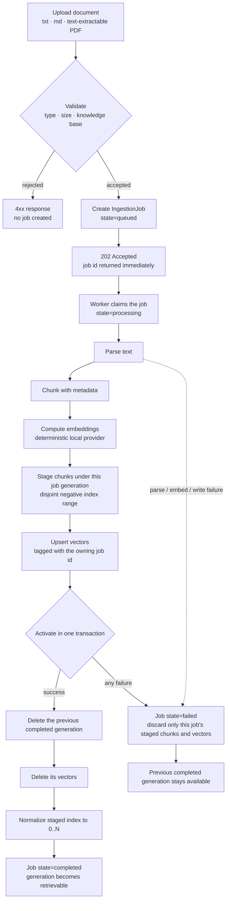
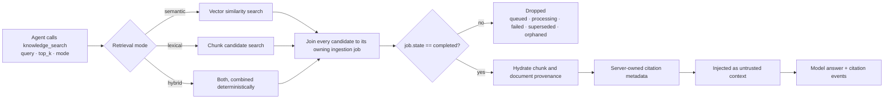

# Knowledge ingestion and RAG lifecycle

This document follows one knowledge document from upload to a cited retrieval result. It describes the
current implementation; `docs/RAG_DESIGN.md` covers the retrieval design and scoring in more depth, and
`docs/V1_STATUS.md` tracks what is validated.

The central rule is **completed-only visibility**: a chunk that does not belong to a `completed`
ingestion job is not retrievable and cannot become a citation, even if its vectors are already in the
database.

## Ingestion lifecycle

Because staging uses an index range disjoint from activated generations, and activation is a single
transaction, an interrupted or failed replacement can never be observed halfway. A failed re-ingestion
leaves the previously completed generation intact and retrievable.

## Retrieval lifecycle

Completed-only filtering is enforced independently on every retrieval path rather than in one shared
place, so a single missed filter cannot leak staged data:

| Path | Location |
|---|---|
| SQLite semantic search | `apps/api/app/knowledge/vector_store.py` |
| PostgreSQL/pgvector semantic search | `apps/api/app/knowledge/vector_store.py` |
| Lexical candidate search used by hybrid mode | `apps/api/app/knowledge/repository.py` |
| Citation hydration of retrieved matches | `apps/api/app/knowledge/repository.py` |

## Guarantees and their evidence

| Guarantee | How it is enforced | Test |
|---|---|---|
| Failed vector writes expose nothing | Staged chunks and vectors are discarded on failure | `test_failed_vector_write_never_exposes_chunks_or_citations` |
| A failed re-ingestion preserves the last good generation | Activation failure only marks the current job failed | `test_failed_reingestion_preserves_last_completed_generation` |
| Orphaned data left by interrupted cleanup is invisible | Every retrieval boundary joins on job state | `test_failed_dirty_generation_is_invisible_to_every_retrieval_boundary` |
| Two jobs never process one document concurrently | Document-level claim serialization | `test_two_sqlite_workers_cannot_process_same_document_concurrently`, `test_duplicate_jobs_for_one_document_do_not_process_concurrently` |
| A staged generation stays hidden until it activates | Negative index range plus completed-only joins | `test_processing_generation_is_hidden_until_restart_recovery` |
| Activation never rewrites an already completed job | Idempotent activation guard | `test_activation_cleanup_never_rewrites_an_already_completed_job` |
| Pre-existing chunks without a generation are fail-closed | Startup migration backfills only unambiguous documents | `test_legacy_chunk_visibility_migration_is_fail_closed` |
| PostgreSQL enforces the same rule | Production SQL carries the same completed-state predicate | `test_pgvector_search_query_requires_completed_generation` |

Test names refer to `apps/api/tests/test_rag.py`.

## Restart behavior

Startup requeues queued jobs and returns abandoned `processing` jobs to `queued` so they are picked up
again. Normalized index values are assigned during activation, so a recovered job cannot collide with an
already activated generation.

## Scope and limits

- Supported inputs are plain text, Markdown, and text-extractable PDF. OCR and scanned PDFs are not supported.
- Embeddings come from the deterministic local provider by default; the OpenAI embedding boundary exists
  but its live behavior is **NOT TESTED**.
- The ingestion worker is application-local, which is why the Docker stack runs a single API process.
- Retrieval quality is not benchmarked against published datasets. The repository contains deterministic
  recall fixtures, not a published benchmark score.
- Retrieved content and durable Memory are untrusted data: they can inform an answer but cannot grant
  tool permissions or act as system instructions.

## Where to read the code

| Concern | Path |
|---|---|
| Upload validation and workflow orchestration | `apps/api/app/knowledge/service.py` |
| Ingestion worker | `apps/api/app/knowledge/worker.py` |
| Parsing and chunking | `apps/api/app/knowledge/parsers.py`, `apps/api/app/knowledge/chunking.py` |
| Embeddings | `apps/api/app/knowledge/embeddings.py` |
| Generation staging, activation, and job queries | `apps/api/app/knowledge/repository.py` |
| Vector search adapters (SQLite and pgvector) | `apps/api/app/knowledge/vector_store.py` |
| Lifecycle tests | `apps/api/tests/test_rag.py`, `apps/api/tests/postgres/test_postgres_workflows.py` |
