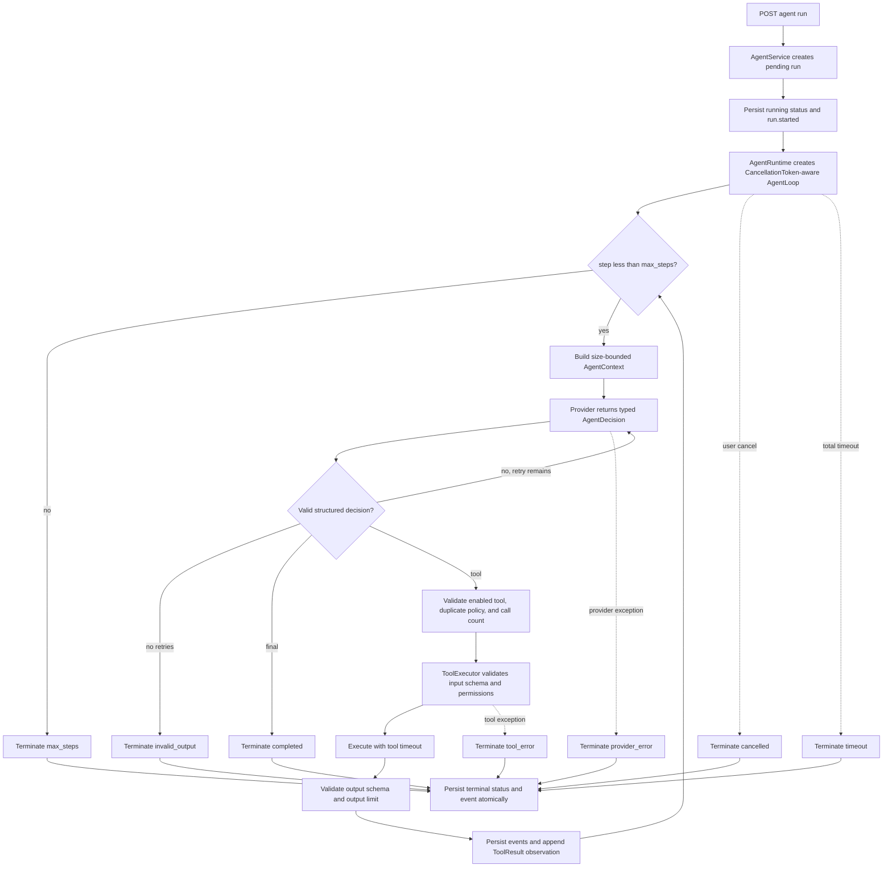

# Agent Runtime hardening run 03

## Scope

This run strengthens only the Agent Runtime / Agent Engine vertical slice. RAG, durable memory,
evaluation dashboards, and substantial UI work remain out of scope.

## Execution flow

Every non-terminal step persists `step`, `llm`, and `tool` events through the service's event sink
before live publication. The persisted trace contains decisions, arguments, bounded observations,
latency, errors, and termination reason, but never private chain-of-thought.

## Pre-change risk audit

| Risk | Prior behavior | Hardened behavior |
|---|---|---|
| Uncontrolled loop | SDK default loop had no application step model or configured limit | Shared outer loop has `max_steps` and explicit `max_steps` termination |
| Tool hallucination | SDK tool exposure constrained names, but Mock and OpenAI paths differed | Every decision is checked against the agent's enabled tools and registry |
| Bad JSON | SDK errors were not normalized into a runtime reason | Pydantic `AgentDecision`; malformed output gets a bounded retry then `invalid_output` |
| Infinite/repeated calls | No application duplicate-call or per-tool call policy | Consecutive identical calls are blocked; per-tool calls are capped |
| Context explosion | Tool output had a limit, but there was no total context/decision budget | Tool output, decision, context, and persisted error sizes are independently bounded |
| Retry storm | No application retry policy | Only invalid structured output is retried, at most three configured retries |
| Duplicate execution | No canonical argument fingerprint | Canonical name/argument fingerprints block consecutive duplicate execution |
| Exception swallowing | Unknown service errors became a generic message without logging | Expected errors map to typed termination; unknown errors are logged at the boundary |
| Cancellation | No API or runtime cancellation token | `POST /runs/{id}/cancel` interrupts provider/tool waits cooperatively |
| Timeout | Tool timeout only | Both per-tool timeout and total run timeout are enforced |

## Runtime contracts

- `AgentState`: lifecycle state used by the engine and trace events.
- `AgentContext`: bounded provider input containing instructions, request, tool schemas, and retained
  observations.
- `AgentStep`: one validated decision plus its optional `ToolResult`.
- `ToolCall` / `ToolResult`: application-owned tool request and observation contracts.
- `AgentRun`: terminal state, steps, output/error, timing, and `TerminationReason`.
- `TerminationReason`: `completed`, `max_steps`, `timeout`, `cancelled`, `provider_error`,
  `tool_error`, or `invalid_output`.

## Verification

Final validation after the timeout-task review fix:

- Backend Ruff format: PASS (`27 files already formatted`).
- Backend Ruff lint: PASS (`All checks passed!`).
- Backend mypy strict: PASS (`Success: no issues found in 21 source files`).
- Backend pytest: PASS (`41 passed`).
- Frontend ESLint: PASS.
- Frontend TypeScript: PASS.
- Frontend Vitest: PASS (`2 passed`).
- Next.js production build: PASS.
- Playwright vertical-slice E2E: PASS (`1 passed`) against isolated ports `3011/8011`.

The first E2E attempt was invalid because fixed ports `3000/8000` reused another worktree's live
services. The test now accepts `AGENT_STUDIO_E2E_BASE_URL`; it was rerun against this worktree's
isolated services without stopping the unrelated servers.

A real OpenAI network call is **NOT TESTED** because no credential was requested or used. The SDK
adapter's typed `AgentDecision`, `max_turns=1`, provider error mapping, client lifecycle, and
application contracts are tested without a network call. PostgreSQL/pgvector is **NOT TESTED** in
this runtime-only change; SQLite persistence and atomic terminal events are exercised by API and E2E
tests.
